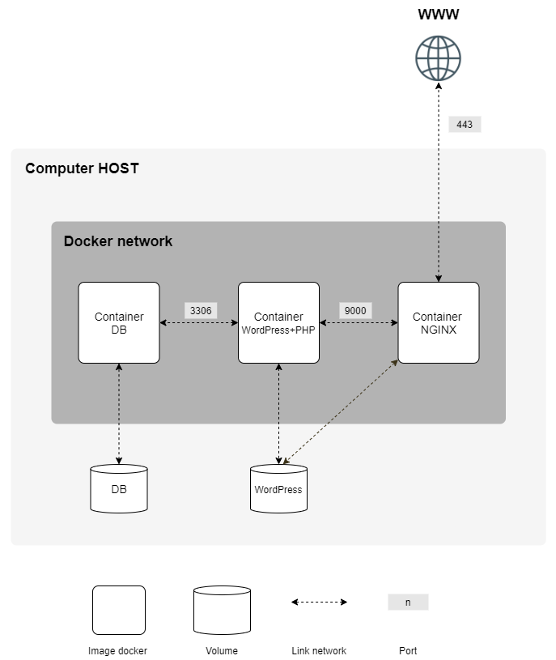

*This project has been created as part of the 42 curriculum by obachuri.*

---

# Inception - Studying Docker

---

## Description

This project aims to broaden your knowledge of system administration by using Docker.

### Project Architecture

## Instructions

## Resources
- [Docker documentation](https://docs.docker.com/)
- [Docker Compose documentation](https://docs.docker.com/compose/)
- [NGINX documentation](https://nginx.org/en/docs/)
- [WordPress documentation](https://wordpress.org/documentation/)
- [WordPress & PHP-FPM Setup Guides](https://wiki.alpinelinux.org/wiki/WordPress)
- [MariaDB documentation](https://mariadb.com/kb/en/documentation/)
- [Redis documentation](https://redis.io/docs/)
- [OpenSSL documentation](https://www.openssl.org/docs/)
- [Start Bootstrap](https://startbootstrap.com/)

### AI Usage
Tools Used: ChatGPT (GPT-4)

AI was used to conceptual understanding and to structuring this README to meet subject requirements.

## License

Part of the 42 curriculum project.
