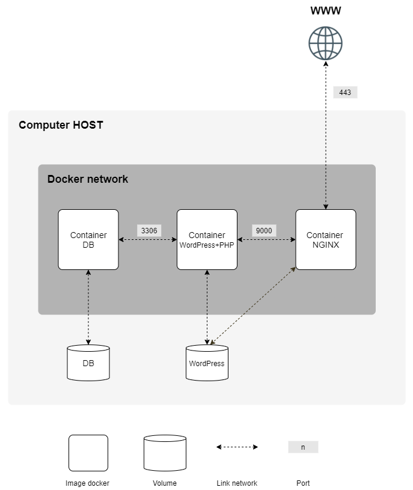
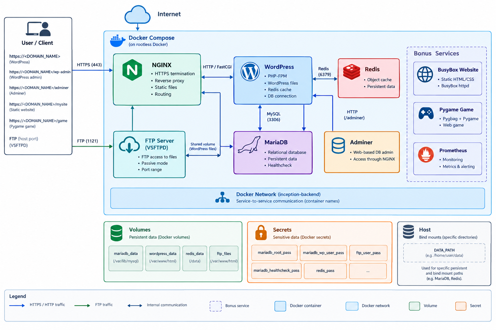

*This project has been created as part of the 42 curriculum by obachuri.*

---

# Inception - Studying Docker

## Description

**Inception** is a 42 School project focused on system administration and containerization using Docker and Docker Compose.

The goal of the project is to build a complete WordPress infrastructure from separate Docker containers, configure communication between services, persist application data, manage credentials securely, and provide a reproducible deployment using Docker Compose.

The project uses custom Dockerfiles and configuration files rather than relying on a preconfigured virtual machine.

The main infrastructure consists of:
- NGINX as the HTTPS entry point
- WordPress running with PHP-FPM
- MariaDB as the WordPress database

Several additional services were implemented as bonus features:
- Redis for WordPress object caching
- Adminer for database administration
- VSFTPD for FTP access to WordPress files
- Prometheus monitoring
- BusyBox static website
- Pygame/Pygbag game

### Project Architecture

#### Basic Architecture


#### Project Architecture with bonus part


#### Included Services

* **NGINX:** - High-performance HTTP web server and reverse proxy known for its speed and low memory use.
* **WordPress:** - The open source publishing platform (CMS) of choice for millions of websites worldwide. Work on PHP.
* **MariaDB:** - The relational database. Used as a WordPress db server.
* **Redis:** - An ultra-fast, in-memory key-value data structure store used as a database, cache, message broker, and streaming engine. In this project used to speed up WordPress performance.
* **Adminer:** - Web-based database management tool.
* **FTP Server (Vsftpd):** - Vsftpd (Very Secure FTP Daemon) is a fast, stable, and secure File Transfer Protocol server designed for Unix-like systems, including Linux.
* **Static Website: (BusyBox)** -  BusyBox HTTP Daemon is a tiny, single-threaded web server built into BusyBox, designed for embedded systems and lightweight environments. There is a static site hosted alongside the main infrastructure.  
* **Prometheus:** - An open-source systems monitoring and alerting toolkit. 

### Project description

#### Virtual Machines vs Docker
A traditional virtual machine (VM) virtualizes an entire operating system. VM provide strong isolation but require significantly more CPU, memory, and storage resources.

A Docker container instead isolates an application and its dependencies while sharing the host kernel. They are lightweight, start quickly, and consume considerably fewer resources.

Containers are therefore generally smaller and faster to start than complete virtual machines.

**Virtual Machine**
```
Host
 |
 +-- Virtual Machine
      |
      +-- Guest OS
           |
           +-- Applications
           +-- Libraries
```           
**Docker**
```
Host
 |
 +-- Docker Engine
      |
      +-- Container
      |    |
      |    +-- Application
      |    +-- Dependencies
      |
      +-- Container
           |
           +-- Application
           +-- Dependencies
```

For this project, each major service is isolated in its own container.

#### Secrets vs Environment Variables

Passwords and other sensitive information should not be hard-coded into Dockerfiles or application source code. 

- **Environment variables** are used for non-sensitive configuration such as: DOMAIN_NAME, FTP_USER, MARIADB_DATABASE. 
- **Secrets** are used for passwords and other sensitive values.

This separation reduces the chance of accidentally exposing credentials through configuration or debugging output.

Docker Compose Secrets are designed for confidential information such as passwords, TLS certificates, and private keys. Secrets are mounted as temporary read-only files inside containers instead of being exposed as environment variables. 

Docker Compose secrets can be mounted into a container as files under: ```/run/secrets/..```

A service receives only the secrets explicitly assigned to it.

#### Docker Network vs Host Network

- Host networking removes network isolation and makes services share the host network stack directly.
- A Docker bridge network keeps containers isolated while still allowing service-to-service communication by container name.

The project uses Docker networks for communication between containers.

#### Docker Volumes vs Bind Mounts

Containers are designed to be replaceable. Data that must survive container recreation should therefore be stored outside the container filesystem. Docker volumes are used for persistent application data.

- Named Docker volumes are managed by Docker and are ideal for durable service data such as MariaDB, Redis storage.
- Bind mounts map an exact host path into a container and are useful when the host must directly access files. 

This project uses both approaches where appropriate.

## Instructions

### Prerequisites
- Linux environment
- Git
- Docker Engine with Compose V2 support
- GNU Make
- Access to local domain mapping (DNS for `login`.42.fr).

###  Clone the project
```
git clone <repository>
cd inception
```

### Configure the environment
Create the required environment configuration and secret files according to the project configuration (change .env file).

Passwords should be provided through the configured Docker secret files.

Create files in secrets deirectory: db_admin_password.txt  db_root_password.txt  db_wp_user_password.txt  ftp_user_password.txt  mariadb_exporter_password.txt  wp_admin_password.txt  wp_user_password.txt

### Main Makefile targets

- `make up` - build and start the project
- `make down` - stop and remove the containers
- `make stop` - stop the containers
- `make start` - start the containers
- `make logs` - follow service logs
- `make clean` - remove containers, networks, and volumes
- `make fclean` - remove all generated data from the host directories
- `make info` - display Docker resources and project state


## Usage

Once the stack is running, the following endpoints are available:
- https://obachuri.42.fr - WordPress main page 
- https://obachuri.42.fr/wp-admin - WordPress admin
- https://obachuri.42.fr/adminer - Adminer - SQL Database management in a single PHP file
- https://obachuri.42.fr/mysite - Simple html page
- https://obachuri.42.fr/game - PacMan game on pygbug+pygame

## Security Note About Docker Volumes
- If you have access to run docker and to read files/folders - you could change or delete this files/folders. Rootless Docker solves this problem, but not completely.

     A user who has sufficient access to the Docker daemon can generally access container files and mounted volumes.
     For example, a privileged Docker user could mount a volume into another container and modify its contents.
     Therefore, Docker access itself should be considered a privileged capability.

     Rootless Docker reduces the privileges of the Docker daemon and containers, but it does not turn Docker into a complete security boundary.

```
	DATA_PATH = path_on_host_to_delete ;
	docker run --rm -v $(DATA_PATH):/data alpine sh -c 'rm -rf /data/*'
```


## Resources
- [Docker documentation](https://docs.docker.com/)
- [Docker Compose documentation](https://docs.docker.com/compose/)
- [NGINX documentation](https://nginx.org/en/docs/)
- [WordPress documentation](https://wordpress.org/documentation/)
- [WordPress & PHP-FPM Setup Guides](https://wiki.alpinelinux.org/wiki/WordPress)
- [MariaDB documentation](https://mariadb.com/kb/en/documentation/)
- [Redis documentation](https://redis.io/docs/)
- [OpenSSL documentation](https://www.openssl.org/docs/)
- [Start Bootstrap](https://startbootstrap.com/)
- [Prometheus - monitoring](https://prometheus.io/docs/instrumenting/exporters/)


### AI Usage
Tools Used: ChatGPT (GPT-5)

AI was used to conceptual understanding and to structuring this README to meet subject requirements.

## License

Part of the 42 curriculum project.
